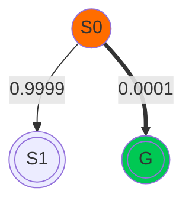
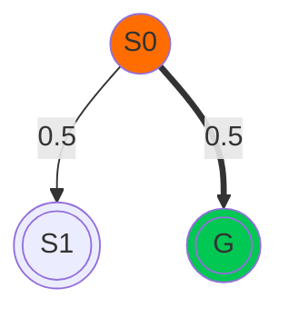
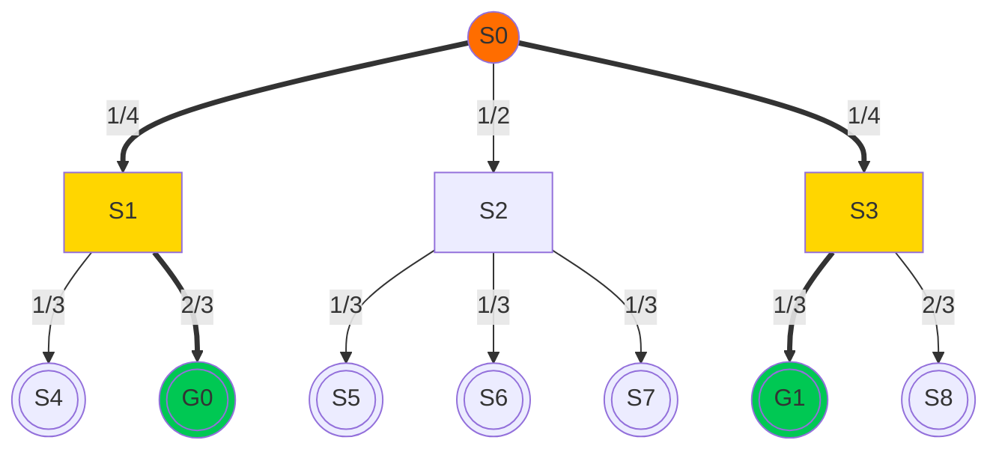

<!--suppress HtmlUnknownTag -->

## The player's policy is not always uniform distribution

<Transform :scale="1.2">

New algorithms: MSI and TSI

</Transform>

---
layout: figure-side
figureUrl: /img/coin.jpg
hideInToc: true
---

# Example

 

<v-click>

| outcome     |   tail    |      head       |
|:------------|:---------:|:---------------:|
| probability | $2^{-10}$ |   $1-2^{-10}$   |
| information |   $10$    | $\approx 0.001$ |

</v-click>

<v-click>

$$
\begin{align*}
H(X) &= -P(\text{head})\log_2 P(\text{head})-P(\text{tail})\log_2 P(\text{tail}) \\
     &= (2^{-10}-1)\times\log_2(1-2^{-10})-2^{-10}\times\log_2(2^{-10}) \\
     &\approx 0.011
\end{align*}
$$

</v-click>

<v-click>

The minimum amount of information required to encode the random variable
is not equal to describing a single outcome

</v-click>

---
layout: two-cols-center
hideInToc: true
---

# Example

::left::

<Transform :scale="1.2" origin="center top">

</Transform>
 

$H(X)\approx 0.0015$
 
$I(G)\approx 13.288$

::right::

<Transform :scale="1.2" origin="center top">

</Transform>
 

$H(X)=1$
 
$I(G)=1$

---
layout: default
hideInToc: true
---

# Recall: MUSE

 

$$
\mu(s)=\log_2|A(s)|+\min_{s_i\in\sigma(s)}\mu(s_i)
$$

$$
\begin{align*}
\mu(X)&=\min_{g\in G}\sum_{s_i\in\tau_g}\log_2|A(s_i)| \\
      &=-\log_2\max_{g\in G}\pi_\mu(g)
\end{align*}
$$

<v-click>

If the player's policy is uniform, then
the information required to communicate  
the solution at each state is not $\log_2|A(s)|$ anymore

</v-click>

---
layout: default
hideInToc: true
---

# Minimum Solution Information (MSI)

 
 

$$
I^*(X)=-\log_2\max_{g\in G}\pi(g)
$$

 

<v-click>

If $\pi=\pi_\mu$, then $I^*(X)=\mu(X)$

</v-click>

<v-click>

This is the minimum amount of information required to communicate  
a **single** goal to the player according to the player's policy.

</v-click>

---
layout: two-cols-title
hideInToc: true
---

# Example: MSI

::left::

<v-click>

$$
\begin{align*}
I^*(s_0)&=-\log_2\max(\pi(g_0),\pi(g1))\\
        &=-\log_2\max(\frac{1}{4}\times\frac{2}{3},\frac{1}{4}\times\frac{1}{3})\\
        &=\log_2 6
\end{align*}
$$

</v-click>

::right::

---
layout: default
hideInToc: true
---

# The Effects of Communication

 
<v-click>

### Assume:

After receiving the communication from the oracle, the player will choose the actions that lead to the goal.

</v-click>
<v-click>

### Conclusion:

In MUSE or MSI, the player's policy will be updated such that $\pi'(a,s)=1$ 
if and only if $s_a=T(s,a)$ is on the solution path and $0$ otherwise.
$T$ is the transition function that maps a state-action pair to a successor state.

</v-click>

<v-click>

We can also use KL-divergence to represent this conclusion:

$$
D_\text{KL}(\pi'(s),\pi(s))=I^*(s)
$$

</v-click>

---
layout: default
hideInToc: true
---

# Total Solution Information (TSI)

 

Similar to ReMUSE, we aggregate the information for all possible goals at each state $s$.

<v-click>

$$
\psi(s)=\min\left\{D_\text{KL}(\pi',\pi)+\mathbb{E}_{\pi'}\left[I\left(\sigma(s)\right)\right]\right\}
$$

</v-click>
<v-clicks>

- $D_\text{KL}(\pi',\pi)$: the information utilized for shifting the player's policy from $\pi$ to $\pi'$
- $\mathbb{E}_{\pi'}\left[I\left(\sigma(s)\right)\right]$: the expected information required for successors of $s$ under new policy $\pi'$

</v-clicks>
<v-clicks>

We want to find an new policy $\pi'$ that minimize the amount of information for communication.

</v-clicks>

---
layout: default
hideInToc: true
---

# Total Solution Information (TSI)

 

After simplification, we get:

<v-click>

$$
\psi(s)=-\log_2\sum_{a\in A(s)}\pi(a, s)\cdot P(g_a\ |\ s_a)
$$

</v-click>
<v-click>

and the new policy is:

$$
\pi'(a, s)=\frac{\pi(a, s)\cdot P(g_a\ |\ s_a)}{\sum_{a\in A(s)}\left[\pi(a,s)\cdot P(g_a\ |\ s_a)\right]}
$$

</v-click>

<v-click>

where $P(g_a\ |\ s_a)$ is the probability of reaching a goal $g_a$ from the successor state $s_a=T(s,a)$ of state $s$ according to $\pi$

</v-click>

---
layout: default
hideInToc: true
---

# Total Solution Information (TSI)

 

$$
\psi(s)=-\log_2\sum_{a\in A(s)}\pi(a, s)\cdot P(g_a\ |\ s_a)
$$

<v-click>

$\pi(a, s)\cdot P(g_a\ |\ s_a)$ is the probability of reaching a goal after taking action a

</v-click>

<v-click>

In other words, TSI at each state $s$ is derived from the probability of reaching any goal from $s$.

</v-click>
<v-click>

Therefore, we can simplify the formula without recursion as:

</v-click>
<v-click>

$$
\psi(X)=-\log_2\sum_{g\in G}\pi(g)
$$

</v-click>
<v-click>

TSI for the puzzle $X$ is derived from the probability of reaching any goal.

</v-click>

---
layout: two-cols-title
hideInToc: true
---

# Example: TSI

::left::

<v-click>

$$
\begin{align*}
\psi(s_0)&=-\log_2(\pi(a_1,s_0)*P(g_0\ |\ s_1)+\pi(a_3,s_0)*P(g_1\ |\ s_3))\\
         &=-\log_2(P(g_0)+P(g_1))\\
         &=-\log_2(\frac{1}{4}\times\frac{2}{3}+\frac{1}{4}\times\frac{1}{3})\\
         &=\log_2 4
\end{align*}
$$

</v-click>

::right::

---
layout: default
hideInToc: true
---

# Summary

 

| **Algorithm** | **Calculation** | **Result Type**  | **Policy** | **Proposed by** |
|:--------------|:---------------:|:----------------:|:----------:|:---------------:|
| MUSE          | single solution |     entropy      |  uniform   |   Chen et al.   |
| ReMUSE        |  all solutions  | relative entropy |  uniform   |   Chen et al.   |
| MSI           | single solution |   information    |    any     |      Shen       |
| TSI           |  all solutions  |   information    |    any     |      Shen       |
