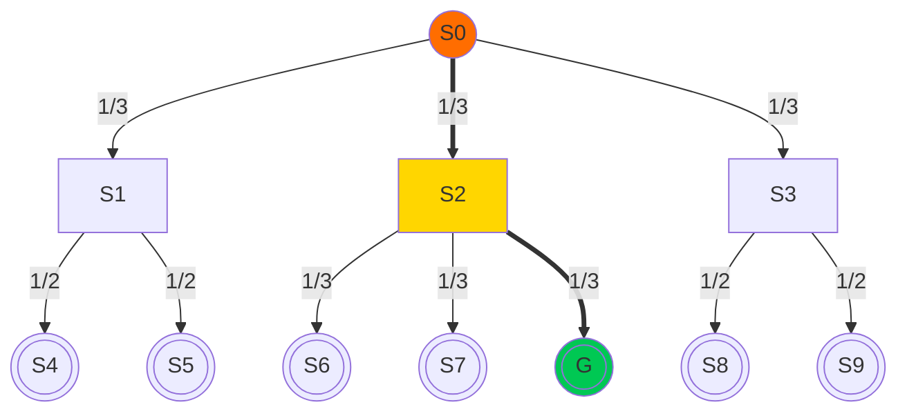
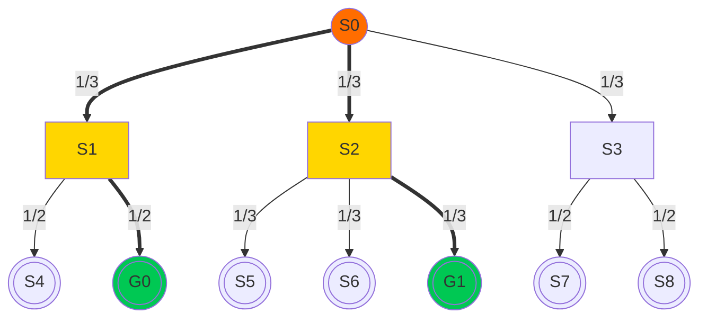
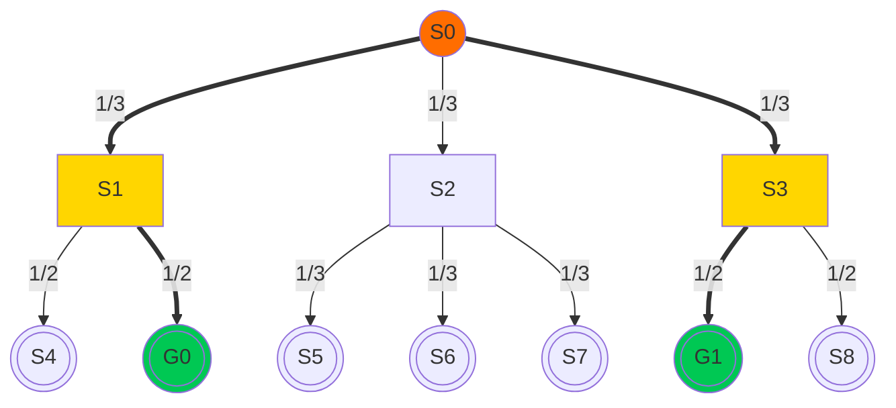

<!--suppress HtmlUnknownTag -->

# Information Theory

 

<v-click>

## Information Content

$$
I(x) = -\log_2P(x)
$$

</v-click>

 

<v-click>

## Information Entropy

$$
\begin{align*}
H(X) &= \mathbb{E}\left[I(X)\right] \\
     &= -\sum_{x\in\mathcal{X}}P(x)\log_2P(x)
\end{align*}
$$

</v-click>

<v-click>

This is the minimum number of bits1
required to encode a message from a source with a given probability distribution without data loss.

<Footnotes>
<Footnote :number=1>binary unit (a.k.a. shannon)</Footnote>
</Footnotes>

</v-click>

---
layout: figure-side
figureUrl: /img/d6.jpg
figureCaption: Standard D6
hideInToc: true
---

# Example

<v-click>

| outcome     |       1       |       2       |       3       |       4       |       5       |       6       |
|:------------|:-------------:|:-------------:|:-------------:|:-------------:|:-------------:|:-------------:|
| probability | $\frac{1}{6}$ | $\frac{1}{6}$ | $\frac{1}{6}$ | $\frac{1}{6}$ | $\frac{1}{6}$ | $\frac{1}{6}$ |
| information |  $\log_2 6$   |  $\log_2 6$   |  $\log_2 6$   |  $\log_2 6$   |  $\log_2 6$   |  $\log_2 6$   |

</v-click>

<v-click>

$$
\begin{align*}
H(X) &= \mathbb{E}\left[I(X)\right] \\
     &= -\sum_{x\in\mathcal{X}}P(x)\log_2P(x) \\
     &= -6\times\frac{1}{6}\log_2\frac{1}{6} \\
     &= \log_2 6
\end{align*}
$$

</v-click>

<v-click>

The minimum amount of information required to encode the whole event
is equal to the information of describing a single outcome
if the probability distribution is uniform.

</v-click>

---
layout: two-cols-title
hideInToc: true
---

# Example: MUSE

::left::

<v-click>

Suppose:

</v-click>

<v-clicks>

- $s_0$ is the initial state, $G$ is the goal state
- Arrows represent player actions
- Player's policy is uniformly random

</v-clicks>

<v-click>

The probability of reaching the goal state is $P(G)=\frac{1}{3}\times\frac{1}{3}=\frac{1}{9}$

</v-click>

<v-click>

If the player's policy is uniform, 
the minimum uniform entropy required to describe a single solution to the puzzle a.k.a. 
Minimum Uniform Solution Entropy
(MUSE) [[Chen et al., 2023](https://ojs.aaai.org/index.php/AIIDE/article/view/27499/27272)] 
is 
$\mu(X)=\log_2(3)+\log_2(3)=\log_2 9$

</v-click>

::right::

<v-click>

Base cases:
- Information for goal state: $0$
- Information for non-goal terminal states: $\infty$

</v-click>

---
layout: two-cols-title
hideInToc: true
---

# Example: MUSE

::left::

If we set 
- $A(s)$ as a function that returns all possible actions at state $s$,  
- $\tau_g$ (the solution path) as the sequence of state-action pairs from $s_0$ to $g$  

<v-click>

Then, we have:
$$
\mu(X)=\sum_{s_i\in\tau_g}\log_2|A(s_i)|
$$

</v-click>

::right::

---
layout: figure-side
figureUrl: /img/d6.jpg
figureCaption: Standard D6
hideInToc: true
---

# Example

 

## What if we want to describe multiple outcomes?

 

<v-click>

### $I(\text{the roll is greater than 3})$

 

### v.s.

 

### $I(\text{the roll is 1})$

</v-click>

---
layout: figure-side
figureUrl: /img/d6.jpg
figureCaption: Standard D6
hideInToc: true
---

# Example

 

## We have:

$$
I(x > 3) = \log_2 2 < I(x = 1) = \log_2 6
$$

## Equivalently:

<Transform :scale="1.4" origin="top left">

"The roll is greater than 3"  
is **less informative** than  
"The roll is 1"

</Transform>

---
layout: two-cols-title
hideInToc: true
---

# Example: MUSE

::left::

In MUSE, if we have multiple goal states, we choose the one with minimum uniform entropy:
$$
\mu(X)=\min_{g\in G}\sum_{s_i\in\tau_g}\log_2|A(s_i)|
$$

<v-clicks>

- $G$: the set of goal states
- $\tau_g$: the sequence of state-action pairs from $s_0$ to $g$ a.k.a. the solution path
- $A(s_i)$: the function that returns the set of possible actions at state $s_i$

</v-clicks>

::right::

 

<v-click>

$$
\begin{align*}
\mu(X)&=\min(\log_2 2+\log_2 3,\log_2 3+\log_2 3)\\
      &=\log_2 6
\end{align*}
$$

</v-click>

---
layout: default
hideInToc: true
---

# Background: MUSE

Using the properties of logarithms, we can show that:

<v-click>

$$
\begin{align*}
\mu(X) &=\min_{g\in G}\sum_{s_i\in\tau_g}\log_2|A(s_i)| \\
       &=\log_2\min_{g\in G}\prod_{s_i\in\tau_g}|A(s_i)| \\
       &=-\log_2\max_{g\in G}\prod_{(s_i,a_i)\in\tau_g}\pi_\mu(s_i,a_i) \\
       &=-\log_2\max_{g\in G}\pi_\mu(g)
\end{align*}
$$

</v-click>

<v-click>

## Conclusion

MUSE is proportional to the probability of the most likely solution path,  
with a uniform probability on all actions

</v-click>

---
layout: default
hideInToc: true
---

# Background: ReMUSE

Relative minimum uniform solution entropy 
(ReMUSE) [[Chen et al., 2023](https://ojs.aaai.org/index.php/AIIDE/article/view/27499/27272)] 
provides a way to aggregate multiple goal states using relative entropy (KL-divergence):

$$
D_\text{KL}(P\ \|\ Q) = \sum_{x\in\mathcal{X}}P(x)\log_2\frac{P(x)}{Q(x)}
$$

KL-divergence measures the amount of information required 
for using the probability distribution $P$ to represent the distribution $Q$.

<v-click>

For ReMUSE, at each state, we compute the relative entropy
between the softmin of successors' relative entropy and the uniform distribution plus the minimum suceessors' entropy.

$$
\rho(s)=D_\text{KL}\left[\underset{s_i\in\sigma(s)}{\text{softmin}}(\rho(s_i))\ \|\ \text{Unif}(|A(s)|)\right]+\min_{s_i\in\sigma(s)}\rho(s_i)
$$

</v-click>

<v-click>

where $\sigma(s)$ is the function that returns the set of successors of state $s$

</v-click>

<v-click>

For direct comparison, the recursive definition of MUSE is:
$\mu(s)=\log_2|A(s)|+\underset{s_i\in\sigma(s)}{\min}\mu(s_i)$

</v-click>

---
layout: two-cols-title
hideInToc: true
---

# Example: ReMUSE

::left::

<v-click>

$$
\begin{align*}
\rho(s_0)&=\min_{s_i\in\sigma(s_0)}\rho(s_i)+D_\text{KL}\left[\underset{s_i\in\sigma(s_0)}{\text{softmin}}(\rho(s_i))\ \|\ \text{Unif}(|A(s_0)|)\right]\\
         &=-\log_2 \frac{1}{2}+\frac{1}{2}\log_2\frac{\frac{1}{2}}{\frac{1}{3}}+\frac{1}{2}\log_2\frac{\frac{1}{2}}{\frac{1}{3}}\\
         &=\log_2 3
\end{align*}
$$

</v-click>

<v-click>

Note: 
If $\rho(s_1)\neq \rho(s_2)$, then softmin scales the probabilities, as
$$
\frac{e^{-\rho(s_1)}}{e^{-\rho(s_1)}+e^{-\rho(s_2)}}=\frac{e^{\log_2 P(g_0)}}{e^{\log_2 P(g_0)}+e^{\log_2 P(g_1)}}=\frac{P(g_0)^{\log_2 e}}{P(g_0)^{\log_2 e}+P(g_1)^{\log_2 e}}
$$

</v-click>

::right::

